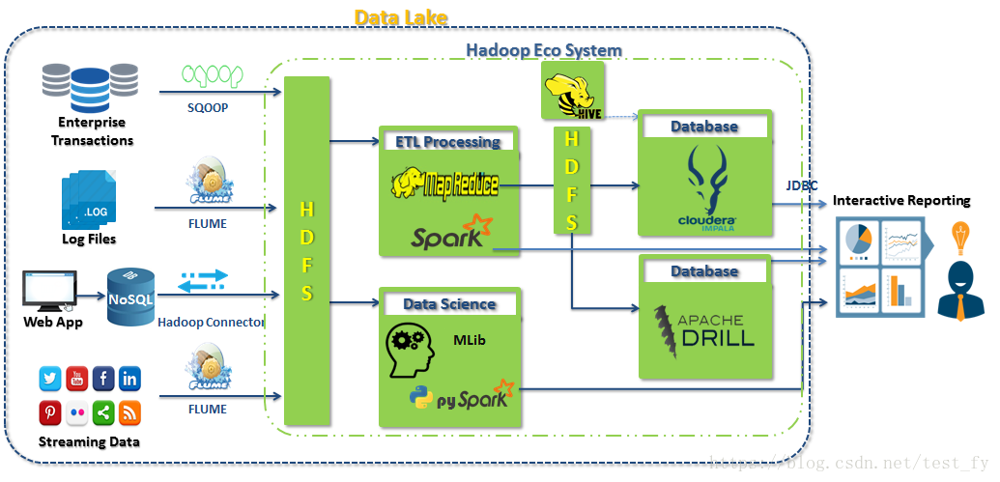

-----------
### 11. Motivace vývoje databázové technologie, technologie pro zpracování Big Data.
Three layers of database modelling
1. [ ] Conceptual
   - Highest level of abstraction
   - Modelling of real-world objects and relationships
   - e.g., ER, UML, …
2. [x] **Logical**
   -   Machine interpretable data structures for storing the modelled
     data
    -  e.g., object, relational, object-relational, XML, graph, …
3. [ ] Physical
      - How logical database structures are implemented in a specific
      technical environment
      - e.g., data files, index structures, …

Relational model
* Basic idea:
    * Storing of object and their mutual associations in tables (relations (relation R from X to Y is a subset of the Cartesian product X × Y.))
    * Row in a table (member of relation) = object/association
    * Column (attribute) = attribute of an object/association
    * Table (relational) schema = name of the schema + list of
attributes and their types
    * Schema of a relational database = set of relational schemas
* Basic integrity constraints
  * Unique identification of a row
  * Simple type attributes 
  * NULL values
* Normalizing data into table form affects performance for
the retrieval of large, complex, and hierarchically
structured data
* OOP 
  * Approach I.: extend objects with data persistence, i.e., databases
  * Approach II.: extend databases with objects
  
TIMELINE

* First generation: navigational
    * Hierarchical model (IBM)
    * Network model (Codasyl)
* Second generation: relational
* Third generation: post-relational
    * Extensions of relational model (Object-relational)
    * New models reacting to popular technologies
    * Object DBS
    * XML (DTD, XML Schema, XPath, XQuery, XSLT) (NON-CORE NoSQL DBS)
    * NoSQL (key/value, column, document, graph, …) - Big Data (CORE DBS)
    * Multi-model systems
    * Back to the relations(NewSQL)

Big Data Tasks

* What do we need to do with Big Data?
    * aggregate
    * manipulate
    * analyze
    * visualize
* A number of techniques and technologies
    * Combination of statistics, computer science, applied
    mathematics, economics, …
* Some adapted from techniques for smaller volumes of data
* Some developed primarily for Big Data
    * New approaches appear rapidly

Big Data Related Technologies
1. [ ] Distributed file systems
    * e.g., HDFS
2. [x] Distributed databases
    * Primarily NoSQL databases
    * And many other types
3. [ ] Cloud computing
4. [ ] Data analytics
    * Batch
    * Real-time
    * Stream

-----------
### 12. ACID, teorém CAP, BASE.

ACID (relační DB)

 * **Atomicity** - série modifikací databáze uskutečňující se během transakce je
provedena celá nebo je databáze ponechána v původním
stavu.
Systém
musí garantovat toto chováni v každé situaci včetně nečekaných poruch
 * **Consistency** -
každá transakce převede databázi z jednoho konzistentního
stavu do druhého
Do databáze budou zapsána pouze data odpovídající integritním omezením.
 * **Isolation** -
data měněná transakcí jsou ostatním uživatelům až do úspěšného
ukončení transakce viditelná v původní podobě, jako byla před začátkem
transakce
 * **Durability** -
změny v databázi vyvolané úspěšně ukončenou transakcí jsou trvale
uloženy na persistentním úložišti.

BASE (NoSQL)

* **Basicaly Available** - aplikace pracuje bez přerušení
* **Soft state** - aplikace nemusí být v každém okamžiku
konzistentní
* **Eventual consistency** - aplikace bude v blíže
neurčené době opět konzistentní

* Při aktualizaci _není zaručeno, že každý, kdo čte z_
_databáze, dostane aktualizovaná_ data.
* Vysoká dostupnost v BASE je dosahována povolením
dílčích chyb tak, aby nedošlo k poruše celého
systému.
* Ošetření případných chyb vzniklých nekonzistencí
není prováděno na datové, ale na aplikační vrstvě.

Teorém CAP u  sdílených/distribuovaných systémů
 * **Consistency**
– každý uzel/klient vidí ve stejný čas stejná data, (data
konzistentní nezávisle na běžících operacích či jejich
umístění)
 * **Availability**
– každý požadavek obsloužen, úspěšně nebo neúspěšně,
(nepřetržitý provoz, vždy možnost zapsat a číst
 * **Partition Tolerance**
– funkční navzdory chybám sítě nebo výpadkům uzlů.
(možnost výpadku části infrastruktury, např. odstávka pro
údržbu)

   
 * Všechny tři vlastnosti jsou žádoucí, ale pro jakýkoliv
systém sdílení dat je možné dosáhnout maximálně dvou
současně.
 * Zvláště u webových aplikací založených na horizontálním
škálování je nutné se rozhodnout mezi konzistencí a
dostupností.

CAP - příklady

* CA
  * Postgres, MySQL, apod. (relational)
* CP 
  * MongoDB (document oriented)
  * Redis (key value)
* AP
  * Voldemort (key value) (Linkedin)

Mnoho společností používá současně
databáze relační (SQL) a NoSQL.

-------------------------------------------

### 13. Vlastnosti No SQL databází. Architektura No SQL, partitioning.

Termín

NoSQL „Not only SQL“ databáze byl
zvolen pro volně specifikovanou třídu
nerelačních datových úložišť.

Nerelační

* Nikdy neposkytují tabulky s plochými záznamy v
pevných sloupcích
* Práce se samostatnými agregáty nebo BLOB
* Nevyžadují objektově relační mapování a normalizaci
dat

Jednoduché rozhraní API
* API umožňují metody zpracování a výběru dat na nízké
úrovni

* Jednotlivé implementace NoSQL databázových
systémů se od sebe hodně liší,
* lze však vysledovat některá opakující se
architektonická řešení,
* u jednotlivých implementací se potom
vyskytují určité rozdíly.

 

Partitioning

- virtual Nodes

 
 

Sharding
* Sharding je metoda, která rozděluje velké
soubory dat rozdělit na několik serverů.
* Metodu používá například MongoDB nebo
Redis .
* Shard v pojetí MongoDB je skupina serverů,
které udržují identické kopie určené části dat.

Hashing
* Nejjednodušší způsob rozdělení dat spočívá v
rozdělení rozsahu primárního klíče
* pomocí hash funkce na stejné části, kdy každá
část leží na jednom serveru. Klient pomocí
hash funkce určí, na kterém serveru leží
požadovaná data.
* Tento přístup využívá například systém
Memcached

Consistent Hashing
* Některé NoSQL databázové systémy, jako Cassandra
nebo MongoDB , používají Consistent hashing .
* V systému Consistent hashing leží celý rozsah
primárního klíče na pomyslném kruhu.
* Každá hodnota primárního klíče má svého správce,
kterým je první nod na pomyslné kružnici ve směru
hodinových ručiček.
* Výhoda řešení:
  * přidání, odebrání nebo výpadek nodu se dotkne pouze
nodů s ním sousedících.
  * Redistribuce dat je nutná pouze mezi těmito sousedícími
nody a ostatních nodů se nijak nedotkne.

 

Replikace
* K zajištění odolnosti proti výpadkům serverů
(při vysokých počtech v infrastrukturách
horizontálně škálovaných databází velmi časté)
a k zajištění vysoké dostupnosti jsou data
udržována ve více kopiích pomocí replikace.
* Replikace současně umožňuje rozkládání
zátěže.

Správa členských serverů ( Membership
* Přidávání i odebírání nodů musí probíhat bez dopadu na
dostupnost databáze.
* Přidání nového nodu:
  * Nod náhodně vybere svoji pozici na pomyslné kružnici hodnot
primárního klíče.
  * Oba nejbližší sousedi předají části svých rozsahů a provedou
změny na replikách.
  * Nový nod si zkopíruje data od svých sousedů a informuje o
nastalých změnách všechny zbývající nody.
  * V případě odebrání nebo havárie nodu nod přestane rozesílat a
odpovídat na stavové zprávy z ostatních nodů.
  * Data azůstávají dostupná na jeho replikách.
  * Sousední nody si opět upraví své rozsahy, včetně všech replik.

Gossip
* Pro šíření stavových informací a detekci
havarovaných nodů je používán protokol
Gossip .
* Gossip nepoužívá broadcasty každý nod
posílá zprávy jen omezenému počtu dalších
nodů.
* Zpráva se postupným předáváním dostane ke
všem nodům.

 ---------------------

### 14. Kategorie NoSQL.

 * Databáze Klíč hodnota ( Key value)
    * Datový model: kolekce klíč hodnota ( key value)
    * př.: Voldemort (Linkedin)
 * Sloupcové databáze ( Column oriented)
   * Datový model: rodiny sloupců ( Column family)
   * př.: Google Bigtable
 * Dokumentové databáze ( Document databases)
    * Datový model: kolekce semistrukturovaných
dokumentů
    * př.: MongoDB
 * Grafové databáze ( Graph databases)
    * Datový model: vrcholy, hrany, key value u obou
    * Neo4j, RDF (Apache fuseki)

---------------------------

### 15. XML databáze – charakteristické vlastnosti, výhody a nevýhody. RDF.

XML

* Uložení v systému souborů
  * DOM (Nutnost držet celý dokument v paměti v průběhu zpracování,
Nutnost analyzovat celý text)
  * SAX ((Simple API for XML): Is a stream-based processor. 
uses almost no memory, but you can't do "DOM" stuff,
like use xpath or traverse trees.)
* Uložení v relační databázi (POMALÉ)
  * se uloží jako BLOB
  * nebo do několika tabulek
* Uložení v objektově orientovaném systému

* Uložení v objektově-relačním databázovém systému
  * Problém s rekurzivními strukturami
* Nativní XML úložiště (BaseX)
  * Rychlost, flexibilita
  * Snadné a efektivní XML dotazování
  * XPath,XQuery, XSLT(styling language (for XML) transforms)

RDF

* grafové databáze

-----------------------------

### 16. Rozdíl mezi JSON a BSON, využití.

BSON is the binary encoding of JSON-like documents that MongoDB uses
when storing documents in collections. It adds support for data types
like **Date** and **binary** that aren't supported in JSON.

-------------------------------------

### 17. Grafové databáze - vlastnosti. Neo4j.

Databáze co mají hodně vztahů mezi entitamy... tvoří (ne)orientovaný graf.

Do databáze se ukládají uzly a jejich vlastnosti a také hrany
mezi těmito uzly. Hlavním přínosem je vyhledání příslušných uzlů v rozsáhlém grafu
na základě implementovaných grafových algoritmů, který je neporovnatelně
rychlejší, než běžná relační databáze. Typickými zástupci jsou: Neo4j, Infinite Graph a další.

Neo4j je databáze, jejíž datový model vychází z teorie grafů.  ACID-compliant transactional database (API hlavně pro JAVU)

* Inspirováno teorií grafů
* Datový model: vrcholy, hrany, key value u
obou

-----------------------------

### 18. Dokumentové databáze - vlastnosti. MongoDB.

Do databáze se ukládají dokumenty ve formátech JSON, případně BSON. Každý ukládaný
dokument může mít jinou strukturu. Typickými zástupci jsou: MongoDB, Elasticsearch a další.

* Datový model: kolekce semistrukturovaných
dokumentů

MongoDB

* Dokumenty ukládané do MongoDB databáze jsou psány ve formátu JSON a fyzicky jsou ukládány
 ve formátu BSON, což je binární podoba JSON doplněná o datové typy.
* Zjednodušeně řečeno, dokument (JSON objekt) je uzavřen do složených {} závorek, jehož obsahem
je zpravidla množina dvojic tvaru 

-----------------------------

### 19. Databáze keyvalue, column.

 Do databáze se obvykle ukládá dvojice: klíč a jeho hodnota. Na základě 
 znalosti klíče jsme schopni z databáze získat
 uloženou hodnotu. Typickými zástupci jsou: Redis, Riak a další. 

* Inspirováno Google Bigtable
* Datový model: rodiny sloupců (Column family)
* př.: Google Bigtable

----------------------

### 20. Big Data – charakteristické vlastnosti (3 (5)V). HDFS (Hadoop Distributed File System).

- **Big Data definice Gartner**

„soubory dat, jejichž velikost je mimo schopnosti

zachycovat, spravovat a zpracovávat data běžně

používanými softwarovými nástroji v rozumném

čase.“

- **Big Data 3V**

  1. Objem (volume ) množství dat vznikajících v rámci provozu firem roste exponenciálně každý rok,

  2. Typ (variety) různorodost typů dat vzrůstá, například nestrukturované textové soubory, semi strukturovaná data (XML), data o geografické poloze, data z logů,

  3. Rychlost (velocity ) rychlost s jakou data vznikají a potřeba jejich analýzy v reálném čase vzrůstá díky pokračující digitalizaci většiny transakcí, mobilním zařízením a vzrůstajícímu počtu internetových uživatelů. 

  4. Věrohodnost ( verosity )

 

HDFS

* Fault Tolerance
  * Detection of faults
  * Quick, automatic recovery
* Batch processing rather than interactive user access
* Master/slave architecture
* NameNode = master server that manages the file
system namespace + regulates access to files by clients (Opening/closing/renaming files and directories)
* DataNode = serves read/write requests from clients +
performs block creation/deletion and replication upon
instructions from NameNode
* NameNode receives HeartBeat and BlockReport from
each DataNode
* Rack-aware replica placement = to take a node's
physical location into account while scheduling tasks and
allocating storage

[//]: # (---------------------)

[//]: # ()
[//]: # (### 21. Spark.)

[//]: # (todo)

--------------------

### 22. Problém zpracování velkých dat, příklady uvedeného typu dat, alternativy zpracování.

viz otázka 11

--------------------

### 23. Princip Map Reduce, Hadoop.

Hadoop

* Framework sada open source komponent
určených pro zpracování velkého množství
nestrukturovaných a distribuovaných dat HDFS
(Hadoop Distributed File Systém)
* Programový model: map reduce (prostředí pro vývoj random Java appky)

--------------------

### 24. Multimodelové databáze, ORDBMS, optimalizace DB.

Kombinují více modelů do jediné databáze. Obvykle se kombinují grafové databáze s dokumentovými
nebo s databázemi klíč-hodnota. Typickým zástupcem jsou ArangoDB, OrientDB a další. 

--------------------

[//]: # (### 25. NewSQL, nové charakteristické vlastnosti, oblasti využití.)

[//]: # (### 26. Polystores.)

[//]: # (### 27. Analýza současného stavu, trendy.)
